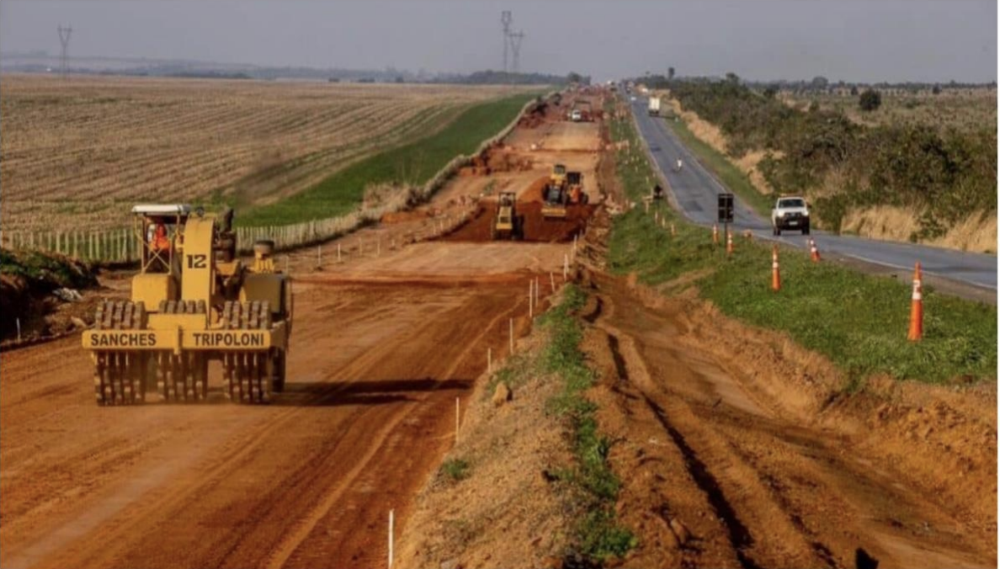

# Deforestation Risk Prediction along Brazil's BR-163 Corridor

*Iroda Ibrohimova*

---

## Overview

This project builds a tabular machine learning pipeline to predict deforestation risk across the BR-163 highway corridor in the Brazilian Amazon. Using five geospatial data sources and 342,819 grid cells, the final XGBoost model achieves an **AUC-ROC of 0.990** with a recall of **0.947**, enabling high-sensitivity identification of at-risk forest areas.

  

## Data Sources

| Source | What it provides |
|--------|-----------------|
| [Hansen GFC](https://glad.earthengine.app/view/global-forest-change) | Tree cover loss (2001–2022), forest cover baseline |
| [OpenStreetMap (OSM)](https://www.openstreetmap.org/) | Road proximity, settlement distance |
| [NASA FIRMS](https://firms.modaps.eosdis.nasa.gov/) | Active fire detections |
| [MapBiomas](https://mapbiomas.org/) | Land use / land cover classification |
| [WDPA](https://www.protectedplanet.net/) | Protected area boundaries |

**Grid cell resolution:** ~1 km²  
**Total features:** 16  
**Total samples:** 342,819

---

## Modeling Pipeline

### Feature Engineering
- Distance-based features (road, settlement, protected area edge)
- Fire density aggregation within radius buffers
- Land cover transition indicators
- Historical deforestation lag features

### Models Evaluated

| Model | AUC-ROC | Recall | Notes |
|-------|---------|--------|-------|
| Logistic Regression (baseline) | 0.921 | 0.831 | L2 regularization |
| Random Forest | 0.978 | 0.912 | 100 estimators |
| **XGBoost (final)** | **0.990** | **0.947** | Best overall |

> **False negatives: 676** — grid cells predicted as safe that are actually at risk. The model is tuned to minimize these given the high cost of missing true deforestation.

### Key Finding
Road proximity and historical fire density are the strongest predictors of near-term deforestation risk, consistent with the "fishbone" deforestation pattern characteristic of the BR-163 region.

---

## Results

- **AUC-ROC:** 0.990
- **Recall (sensitivity):** 0.947
- **False Negatives:** 676 out of ~12,000 positive cases
- **Threshold:** 0.35 (tuned to maximize recall)

---

## Tech Stack

`Python` · `XGBoost` · `scikit-learn` · `pandas` · `geopandas` · `matplotlib` · `Jupyter`

---

## Files

| File | Description |
|------|-------------|
| [`D2_Modeling_iibrohim.ipynb`](D2_Modeling_iibrohim.ipynb) | Full modeling pipeline with EDA, feature engineering, experiments |
| [`D2_Modeling_iibrohim.html`](D2_Modeling_iibrohim.html) | Rendered notebook (no Jupyter needed) |
| [`data/br163_features.csv.gz`](data/br163_features.csv.gz) | Compressed feature matrix |
| [`report/D2_Report_iibrohim.pdf`](report/D2_Report_iibrohim.pdf) | Written report with methodology and analysis |

---

## Author

**Iroda Ibrohimova**  
Information Systems, Carnegie Mellon University Qatar  
iibrohim@andrew.cmu.edu · [LinkedIn](https://www.linkedin.com/in/iroda-ibrohimova-73098924a)
